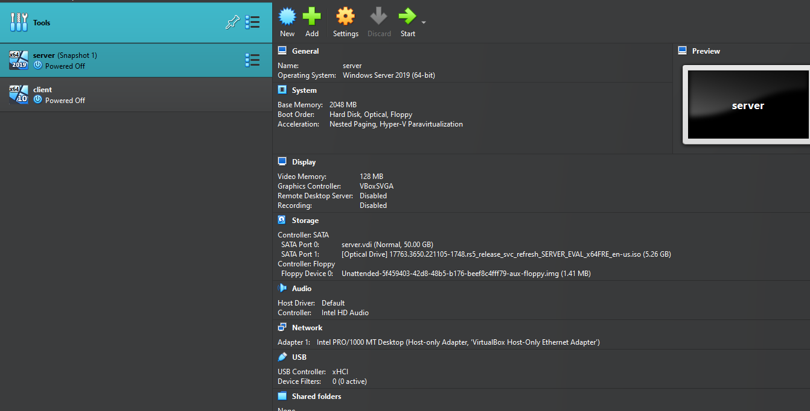

# Window-server-Homelab-Active-directory
Installing Windows Server in VirtualBox
Before configuring Active Directory, I set up a virtualized lab environment using Oracle VirtualBox.

Steps:

Created a new Virtual Machine:
Selected the Windows Server 2022 ISO as the installation medium.
Assigned 2 GB RAM and 1 CPU cores for performance.
Installed Windows Server OS:
Performed a standard installation with Desktop Experience.
Set a secure administrator password.
Configured Network:
Set the network adapter to Internal Network to allow communication between VMs.
Assigned a static IP to the server.

Objective
This document outlines the process of setting up and managing Organizational Units (OUs), groups, and users within Active Directory (AD) using Windows Server. It serves as a guide to implementing a structured AD environment for organizational needs, including user rights management, resource access, and departmental groupings.

1. Setting Up Organizational Units (OUs)
I started by organizing the Active Directory environment into various Organizational Units (OUs) to maintain a structured hierarchy within the domain. OUs are essential for delegating administrative control and applying group policies effectively.

📌 [INSERT SCREENSHOT HERE: Creation of USA, Europe, Asia OUs]

Create Sub-OUs:
Inside each regional OU, I created sub-OUs for Users, Computers, and Servers.
Example structure:

📌 [INSERT SCREENSHOT HERE: Sub-OUs under USA]

Organize Resources:

I moved user and computer accounts into their respective OUs.

📌 [INSERT SCREENSHOT HERE: Populated OUs with user and computer objects]

Group T

Used to assign access to files, folders, printers, and applications.

Example: IT-SecurityGroup, HR-SGroup

📌 [INSERT SCREENSHOT HERE: Security group creation window]

Group Scopes:

Global: Used within the same domain.

Universal: Used across domains (especially in forests).

Domain Local: Used to assign permissions only within the domain.

📌 [INSERT SCREENSHOT HERE: Group scope options dropdown]

3. Creating and Managing Users
Although automation is preferred, I manually created user accounts for this demonstration.

Steps:
Create Users in Appropriate OUs:

Navigated to the Users OU under each region.

Created users like EastFmer, assigned email format: eastfmer@eastcharmer.local

📌 [INSERT SCREENSHOT HERE: User creation wizard]

Password Policy:

Enforced strong passwords, configured expiration, and lockout rules.

🛠️ [INSERT SCREENSHOT HERE: Password policy settings or Fine-Grained Policy summary]

Assign Users to Groups:

Each user was added to their respective department group for role-based access.

📌 [INSERT SCREENSHOT HERE: User group membership tab]

4. Assigning Permissions
I used the created groups to manage access to shared resources like department folders.

I worked on configuring several key Group Policy Objects (GPOs) in my Active Directory setup. The idea was to tighten security, standardize the user environment, and automate some user-side tasks. Every GPO I created had a reason behind it, and I’ve documented my process here.

GPO 1: Password Policy

Goal: Make sure everyone uses strong passwords.
So first, I created a GPO called Password Policy and linked it to the domain. Then I went to:
Computer Configuration → Policies → Windows Settings → Security Settings → Account Policies → Password Policy
Here’s what I configured:
Complexity requirement? Turned it on.
Max password age? 90 days.
Minimum password age? Auto-set once complexity was enforced.
Screenshot Placeholder: [Screenshot of configured password policy settings]

GPO 2: Drive Mapping
Goal: Automatically give users access to a shared folder as a mapped drive.
I created another GPO named Drive Mapping and edited it under:
User Configuration → Preferences → Windows Settings → Drive Maps
I set it to map a drive with:
Path: \\ServerName\SharedFolder
Drive Letter: E:
Action: Create (because I wanted it to show up every time they log in)
creenshot Placeholder: [Screenshot of drive map creation dialog]

GPO 3: Desktop Wallpaper
Goal: Set a clean, uniform wallpaper for all users—mostly for branding and aesthetics.
I made a GPO called Desktop Wallpaper and went here:
User Configuration → Policies → Administrative Templates → Desktop → Desktop
Enabled the setting and pointed it to:
\\ServerName\Wallpapers\company_wallpaper.jpg
Style set to “Fill” so it looks neat across different screen sizes.
Screenshot Placeholder: [Screenshot showing the wallpaper path configuration]

GPO 4: Restrict Control Panel Access
Goal: Keep users from messing with system settings.
I created a GPO called Restrict Control Panel, then did the following:
User Configuration → Policies → Administrative Templates → Control Panel
Enabled: Prohibit access to Control Panel and PC settings
And just like that, users no longer had access to tweak things they shouldn’t.
Screenshot Placeholder: [Screenshot showing the restriction setting enabled

GPO 5: Disable USB Storage Devices
Goal: Lock down USB storage to avoid data leakage or malware.
Created the GPO Disable USB Storage, went here:
Computer Configuration → Policies → Administrative Templates → System → Removable Storage Access
Then enabled: All Removable Storage classes: Deny all access
It effectively blocked USB drives from working.
Screenshot Placeholder: [Screenshot showing the deny all access setting]
Bonus Task: Account Lockout Policy (Coming Soon)
Goal: Make brute-force attacks less likely.
This one’s on my to-do list. Here's the plan:
Create a Account Lockout Policy GPO
Go to: Computer Configuration → Policies → Windows Settings → Security Settings → Account Policies → Account Lockout Policy
Set:
Threshold: 5 failed attempts
Duration: 15 minutes
Reset counter: 15 minutes
Screenshot Placeholder: [Placeholder for lockout policy configuration screen]

To apply and test Group Policy Objects (GPOs) across domain-joined computers and users within a structured Active Directory environment.

🔹 1. Environment Setup Summary
Domain Name: [Insert Domain Name, e.g., corp.local]

Server Role: Domain Controller (Windows Server 2019)

Client System: Windows 10 VM joined to domain

Virtualization Platform: [Insert, e.g., VMware Workstation]

OUs Created:

USA > Users

USA > Computers

🔹 2. GPOs Created
I created the following GPOs using Group Policy Management Console (GPMC):

GPO Name	Configuration Type	Description
Restrict Control Panel	User Configuration	Prevents access to Control Panel
Password Policy	Computer Configuration	Enforces password complexity and expiration
Drive Mapping	User Configuration	Maps network drive for users
Disable USB Devices	Computer Configuration	Blocks USB storage device usage
Set Wallpaper	User Configuration	Applies company-branded wallpaper
🔹 3. GPO Assignment to OUs
I assigned each GPO to the appropriate Organizational Unit based on its configuration type:

Restrict Control Panel → Linked to USA > Users

Password Policy → Linked to USA > Computers

Drive Mapping → Linked to USA > Users

Disable USB Devices → Linked to USA > Computers

Set Wallpaper → Linked to USA > Users

These assignments ensure that user-specific policies apply only to user accounts and machine-specific policies to computers.

🔹 4. Domain-Join & OU Cleanup
After joining the Windows 10 client to the domain:

The computer account appeared in the default Computers container.

I moved the computer to the USA > Computers OU using Active Directory Users and Computers (ADUC) for proper GPO targeting.

I added a description to the computer object for asset tracking.

Screenshot Placeholder:
[Insert Screenshot: Active Directory Users and Computers showing the computer account under default "Computers" container]

🔹 5. GPO Testing and Validation
To test the "Restrict Control Panel" policy:
Logged into the domain-joined client using a test domain user.
Attempted to open the Control Panel — it was accessible initially.
Launched Command Prompt as Administrator and ran:

bash
Copy
Edit
gpupdate /force
Waited for the policy update confirmation.

Re-attempted to access Control Panel — access was denied as expected.
Screenshot Placeholder:
[Insert Screenshot: Command Prompt window showing gpupdate /force output]
[Insert Screenshot: Access Denied message on Control Panel after GPO application]
✅ Result: GPO successfully applied and functional.

Windows Server: File Server Resource Manager (FSRM) – Quota & File Screening Configuration
✅ Objective
To configure and enforce folder quotas and file screening policies on shared folders using File Server Resource Manager (FSRM) in a Windows Server environment. This helps manage storage consumption and prevent storage bloat by restricting unwanted file types.

1. 🔧 Installing File Server Resource Manager (FSRM)
I began by installing the File Server Resource Manager role on my Windows Server to enable quota and file screen configuration.

Steps:
Opened Server Manager.

Navigated to Manage → Add Roles and Features.

Selected Role-based or feature-based installation.

Chose the local server.

Under File and Storage Services, I expanded File and iSCSI Services.

Selected File Server Resource Manager and added features.

Clicked Next and installed the role.

📸 [Insert Screenshot: Add Roles and Features wizard with File Server Resource Manager selected]

Once the installation succeeded, I verified it by checking Administrative Tools.

📸 [Insert Screenshot: FSRM appearing under Administrative Tools]

2. 📂 Quota Management Configuration
To prevent overuse of shared storage, I configured custom quota settings on the shared folder.

Steps:
Opened File Server Resource Manager.

Expanded Quota Management → Right-clicked on Quotas → Selected Create Quota.

Chose the folder path for quota application (e.g., C:\Shares\DeptShared).

📸 [Insert Screenshot: Quota path selection for shared folder]

Selected "Define custom quota properties".

Set a hard quota limit of 10 GB.

Added a description: "Storage limit for department shared folder. Please do not exceed."

📸 [Insert Screenshot: Custom quota definition page]

Notifications:
Added a threshold at 80% usage to notify IT admins via email.

Configured email alert settings under threshold options.

Added note: “Notify team when usage reaches 80% of storage limit.”

📸 [Insert Screenshot: Notification threshold settings screen]

3. 🔐 File Screening Management
To avoid storage bloat from large files, I set up file screening policies to restrict users from saving certain file types like videos, music, and executables.

Steps:
In FSRM, expanded File Screening Management.

Right-clicked File Screens → Chose Create File Screen.

Selected the same folder path (e.g., C:\Shares\DeptShared).

📸 [Insert Screenshot: File screen folder path selection]

Clicked Define custom file screen properties.

Blocked the following file groups:

Audio and Video Files

Compressed Files

Executable Files

Image Files

Web Page Files

📸 [Insert Screenshot: File types selected for blocking]

Allowed only Document Files and Text Files for the shared folder.

Named the template: Shared_Dept_FileScreen_Policy.

📸 [Insert Screenshot: Custom file screen template with selected settings]

4. 🛡️ Summary of Results
Successfully enforced a 10 GB quota limit on the departmental shared folder.

Configured an 80% usage notification to alert IT admins proactively.

Implemented a file screening policy to block media and executable files, helping to preserve storage space and maintain security.

All configurations were validated by testing file uploads and observing quota triggers.

📸 [Insert Screenshot: Quota and File Screen summary page in FSRM]

Password Policy Configuration (Group Policy Management)
In this part of the lab, I configured and enforced a strong password policy for all Active Directory users. This is foundational for securing accounts and protecting against unauthorized access.

🧠 What I Did
I edited the Default Domain Policy to apply a secure password policy to all domain users. This includes setting:

Minimum password length

Password complexity

Password history

Password expiration (age)

The default minimum password length in Windows Server is 8 characters, which is outdated. I increased it to 12 characters for stronger protection in today's digital environment.

🔧 Steps I Followed
Open Group Policy Management Console (GPMC)

Start → Administrative Tools → Group Policy Management

Edit the Default Domain Policy

Navigated to:
Forest > Domains > yourdomain.local > Default Domain Policy

Right-clicked and selected Edit

📸 [Insert Screenshot – Editing Default Domain Policy]

Navigate to Password Policy

Inside Group Policy Management Editor:

Computer Configuration → Policies → Windows Settings → Security Settings → Account Policies → Password Policy

📸 [Insert Screenshot – Password Policy Location]

Configured the following settings:

Enforce password history: 5 passwords remembered

Maximum password age: 90 days

Minimum password length: 12 characters

Password must meet complexity requirements: Enabled
(Includes uppercase, lowercase, numbers, symbols)

📸 [Insert Screenshot – Edited Password Policy Settings]

✅ Testing the Policy
To test if the new policy was enforced:

Created a test user in Active Directory

Checked “User must change password at next logon”

Logged in as the test user and tried setting a weak password: 1234567

📸 [Insert Screenshot – Password Rejected Due to Weakness]

Then, I set a strong password meeting all complexity rules. It was accepted, confirming that the policy was active.

📸 [Insert Screenshot – Successful Strong Password Change]

🔒 Account Lockout Policy
Next, I configured the Account Lockout Policy to protect against brute force attacks by locking accounts after a few failed login attempts.

🛠️ Configuration Steps
Edited the Default Domain Policy again (same steps as above)

Navigated to: Computer Configuration → Policies → Windows Settings → Security Settings → Account Policies → Account Lockout Policy

Set the following:

Account lockout threshold: 3 invalid attempts

Account lockout duration: 30 minutes

Reset account lockout counter after: 30 minutes

📸 [Insert Screenshot – Account Lockout Policy Settings]

✅ Testing Account Lockout
Logged in as a test user

Entered wrong passwords 3 times

Got an error that the account was locked out

📸 [Insert Screenshot – Account Locked Message]

👥 User Rights Assignment
This step is about defining what specific users or groups can/cannot do on the domain, improving role-based security.

🎯 What I Configured
Denied logon locally for the HR group

Allowed Remote Desktop logon only for the IT group

🔧 Configuration Steps
Created a new Group Policy Object named User Rights

Navigated to:
Computer Configuration → Policies → Windows Settings → Security Settings → Local Policies → User Rights Assignment

Denied log on locally

Set to: HR Department

📸 [Insert Screenshot – Deny Log On Locally Policy]

Allowed log on through Remote Desktop Services

Set to: IT Department

📸 [Insert Screenshot – Remote Desktop Logon Policy]

✅ Testing
Logged out from admin

Tried logging in as an HR user directly to the server → Denied

Tried using RDP as an HR user → Denied

Tried using RDP as an IT user → Successful

📸 [Insert Screenshot – Logon Denied (HR)]
📸 [Insert Screenshot – RDP Success (IT)]

In this part of the lab, I configured Fine-Grained Password Policies (FGPP) using the Active Directory Administrative Center (ADAC) instead of Group Policy. FGPP allows me to enforce different password policies for different users or groups, giving more flexibility and control over account security.

For example, I applied stricter password requirements to IT Admins, while giving more lenient rules to Standard Users.

🎯 Why Use FGPP?
Unlike the default domain-wide policy, Fine-Grained Password Policies let me:

Require stronger passwords for admins

Allow simpler passwords for service accounts or regular users

Apply policies per user or per group

🧰 Tools Used
Active Directory Administrative Center (not Group Policy)

Accessed via:
Start → Windows Administrative Tools → Active Directory Administrative Center

📸 [Insert Screenshot – Opening Active Directory Administrative Center]

🔧 Creating a Fine-Grained Password Policy for Admins
Step-by-Step:
Opened Active Directory Administrative Center

On the left pane, I clicked my domain name:
e.g., corp.local

Navigated to:
System → Password Settings Container

📸 [Insert Screenshot – Navigating to Password Settings Container]

In the right pane, I clicked New → Password Settings

📸 [Insert Screenshot – Creating New Password Settings]

Filled out the Password Settings form:

Name: Admin_PasswordPolicy

Precedence: 1 (lower number = higher priority)

Minimum password length: 15

Enforce password history: 3

Password must meet complexity requirements: Enabled

Maximum password age: 60 days

Minimum password age: 1 day

Lockout threshold: 3

Lockout duration: 30 minutes

📸 [Insert Screenshot – Admin Policy Settings Filled In]

At the bottom, I clicked Add to choose which group this applies to.

Selected the group: IT Admins

📸 [Insert Screenshot – Adding IT Admins Group to the Policy]

Clicked OK to save the policy.

✅ Result: A Fine-Grained Password Policy named Admin_PasswordPolicy now applies to all members of the IT Admins group.

🔁 Creating a Policy for Regular Users
To apply a different password policy to regular users:

Repeated the steps above but created a new policy:

Name: StandardUsers_PasswordPolicy

Precedence: 2 (higher number than the admin policy)

Minimum password length: 10

Enforce password history: 2

Maximum password age: 90 days

Complexity requirements: Enabled

Group applied to: Domain Users (or a custom group like Standard Users)

📸 [Insert Screenshot – Standard Users Policy Settings]

✅ Now, this policy is applied to all regular users in the domain.

📌 How Precedence Works
If a user belongs to multiple groups, each with its own password policy, the policy with the lowest precedence number takes effect.

For example:

Admin policy has precedence 1

User policy has precedence 2

Any user in both groups will receive the Admin policy.

✅ Testing the Policy
I created two test accounts:

admin.test → Member of IT Admins

user.test → Member of Standard Users

I tried changing their passwords to:

A short password: Test123! → Rejected for admin.test

A longer password: ComplexPassword2024! → Accepted for admin.test

A 10-character password → Accepted for user.test

📸 [Insert Screenshot – Password Rejected Due to FGPP]

📸 [Insert Screenshot – Password Accepted with FGPP]

