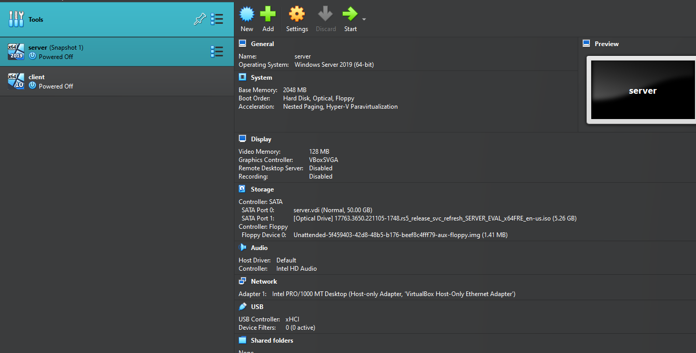

# Window-server-Homelab-Active-directory
Installing Windows Server in VirtualBox
Before configuring Active Directory, I set up a virtualized lab environment using Oracle VirtualBox.

Steps:

Created a new Virtual Machine:
Selected the Windows Server 2022 ISO as the installation medium.
Assigned 2 GB RAM and 2 CPU cores for performance.
Installed Windows Server OS:
Performed a standard installation with Desktop Experience.
Set a secure administrator password.
Configured Network:
Set the network adapter to Internal Network to allow communication between VMs.
Assigned a static IP to the server.

