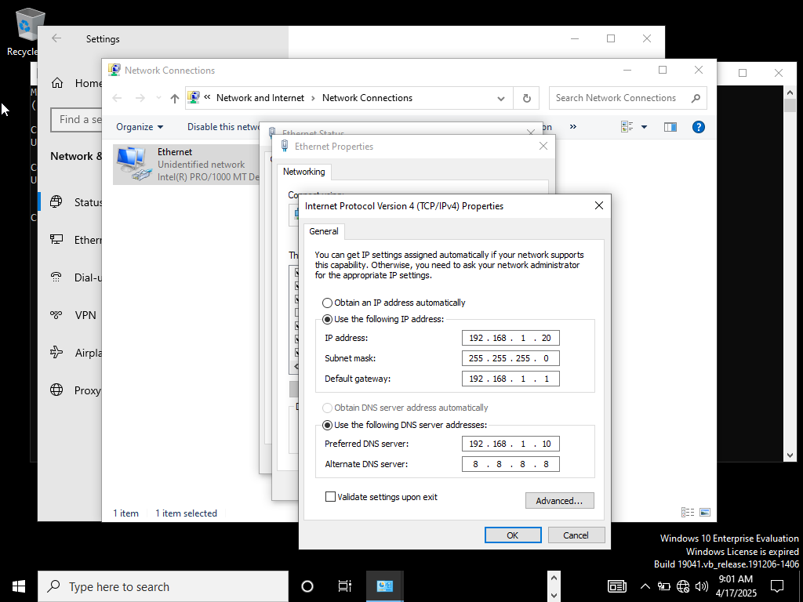

This lab allowed me to simulate a real-world domain environment where I could confidently configure domain controllers, group policies, and file server roles from scratch. My goal was to better understand how IT administrators manage user access, enforce security policies, and organize resources across a networked environment. I documented every step I took, from setting up the server and client machines to validating group policy effects on a domain-joined computer.

### VM Setup in VirtualBox
- Created a new Virtual Machine.
- Selected the Windows Server 2022 ISO as the installation medium.
- Assigned 2 GB RAM and 1 CPU core.
- Installed Windows Server OS with Desktop Experience.
- Set a secure administrator password.
- Set the network adapter to "Internal Network."
- Assigned a static IP address.

---

### Active Directory Installation

I installed the Active Directory Domain Services (AD DS) role using the Server Manager:

Opened Server Manager > Add Roles and Features.  
Selected Role-based or feature-based installation.  
Chose the local server as the destination.  
Selected Active Directory Domain Services from the server roles.  
Completed the wizard and restarted the server when prompted.

After the role installation:  
Opened Server Manager and clicked the notification flag.  
Selected Promote this server to a domain controller.  
Created a new forest named patrick.com  
  
Set a Directory Services Restore Mode (DSRM) password.  
Completed the configuration and rebooted the server.

After reboot:  
Verified the server is now a domain controller.  
Logged in as patrick\Administrator.  
Confirmed the presence of Active Directory tools (ADUC, DNS, etc).

---

### Windows 10 Client Setup and Domain Join

#### VM Creation and Configuration
- Created a new virtual machine for the Windows 10 client in VirtualBox
- Installed Windows 10 Pro using ISO
- Assigned 2 GB RAM, 1 CPU core
- Set network adapter to **Internal Network**

#### Network Configuration
- Assigned static IP in the same subnet as the domain controller
- Set Preferred DNS to DC IP

**Example:**
- IP: `192.168.10.20`
- Subnet: `255.255.255.0`
- Default Gateway: `192.168.10.1`
- Preferred DNS: `192.168.10.10`

#### Joining the Domain
- Verified connectivity to the domain controller
- Joined the domain `patrick.com` using domain credentials

---

### Active Directory: OUs, Users, Groups & Permissions

#### Organizational Units (OUs)
I structured Active Directory with top-level OUs per region (USA, Europe, Asia) and created sub-OUs inside each for Users, Computers, and Servers.

- **Example:**
  - USA > Users
  - USA > Computers
  - USA > Servers

  

#### Users
Manually created users `Joshua` and `vboxuser`, and assigned them to OUs and groups under the domain `Patrick.com`.

- Example: `joshua@patrick.com`, `vboxuser@patrick.com`
- Password policy: Complexity, expiration, lockout settings enforced.

  
  

#### Groups and Group Scopes
Created security groups (e.g., IT-SecurityGroup, HR-SGroup) for permission assignment.

- Group Scopes:
  - Global: Same domain
  - Universal: Cross-domain (forests)
  - Domain Local: Within domain only

---

### Group Policy Objects (GPOs)

#### GPO Assignments:
| GPO Name               | Type                  | Linked OU       |
|------------------------|-----------------------|-----------------|
| Restrict Control Panel | User Configuration    | USA > Users     |
| Password Policy        | Computer Configuration| USA > Computers |
| Drive Mapping          | User Configuration    | USA > Users     |
| Disable USB Devices    | Computer Configuration| USA > Computers |
| Set Wallpaper          | User Configuration    | USA > Users     |

#### GPO 1: Password Policy + Account Lockout Policy
Edited the Default Domain Policy to apply a secure password policy to all domain users in `Patrick.com`:

- Minimum password length: 12  
- Enforced complexity and history  
- Max age: 90 days  

Also configured lockout policy:  
Computer Configuration → Policies → Windows Settings → Security Settings → Account Policies

- Threshold: 3 failed logins  
- Lockout duration: 30 minutes  
- Reset counter: 30 minutes  

✅ Testing the Password Policy

Created a test user in Active Directory.

Set “User must change password at next logon.”

Logged in as the test user and tried setting a weak password: 1234567 → ❌ Rejected.

Then set a strong password meeting all complexity rules → ✅ Accepted.

✅ Testing Account Lockout Policy

Logged in as a test user.

Entered wrong passwords 3 times.

Got an error: “Account has been locked out.”

#### GPO 2: Drive Mapping
Location: User Configuration → Preferences → Windows Settings → Drive Maps

#### GPO 3: Desktop Wallpaper
Applies a uniform wallpaper via 

#### GPO 4: Restrict Control Panel Access
Prevents users from accessing system settings.

#### GPO 5: Disable USB Storage Devices
Blocks access to USB drives.

---

### GPO Testing and Validation

To test the "Restrict Control Panel" policy:  
Logged into the domain-joined client using a test domain user.  
Attempted to open the Control Panel — it was accessible initially.  
Launched Command Prompt as Administrator and ran:  

`gpupdate /force`  
Waited for the policy update confirmation.  
Re-attempted to access Control Panel — access was denied as expected.  

  

✅ Result: GPO successfully applied and functional.

---

### File Server Resource Manager (FSRM)

#### Installation
Installed FSRM role via Server Manager > Add Roles and Features.

  

#### Quota Management
- Applied 10 GB quota 
- Notification at 80% usage

  
  

#### File Screening
- Blocked Audio, Video, Executables, Compressed Files, etc.
- Allowed only Document and Text Files

---

### User Rights Assignment

#### What I Did
- Denied log on locally for HR group  
- Allowed RDP for IT group  

Location:  
Computer Configuration → Policies → Windows Settings → Security Settings → Local Policies → User Rights Assignment

  

---

### Fine-Grained Password Policies (FGPP)

#### Why Use FGPP?
Unlike the default domain-wide policy, Fine-Grained Password Policies let me:
- Require stronger passwords for admins
- Allow simpler passwords for service accounts or regular users
- Apply policies per user or per group

#### Configuration Steps
Opened Active Directory Administrative Center from the Start menu  
Navigated to System > Password Settings Container  
Right-clicked and selected New → Password Settings  
Assigned the policy to a specific group  
Adjusted precedence  

  

#### Admin Password Policy
- Name: `Admin_PasswordPolicy`
- Min length: 15
- Lockout threshold: 3
- Group: IT Admins

#### Standard Users Policy
- Name: `StandardUsers_PasswordPolicy`
- Min length: 10
- Group: Domain Users

#### Precedence Notes
- Lower number = higher priority
- Users in both policies get `Admin_PasswordPolicy`

Working through this lab gave me a solid grasp of how Windows Server environments operate behind the scenes. I learned how to:

Promote a server to a domain controller and manage domain-wide configurations.

Create and manage OUs, users, computers, and security groups with proper hierarchy.

Deploy and troubleshoot Group Policy Objects (GPOs) to enforce security standards.

Configure File Server Resource Manager (FSRM) for quota management and file screening.

Implement Fine-Grained Password Policies (FGPP) for more targeted account security.

Join client machines to a domain and verify real-time policy propagation.
